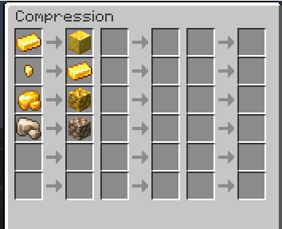
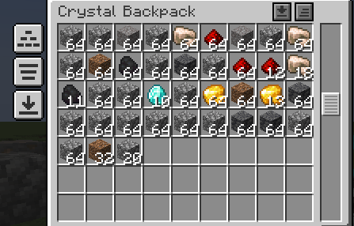

---
navigation:
  title: Crystal Backpack
  icon: crystal_backpack
  parent: index.md
item_ids:
  - crystal_tools:crystal_backpack
---

# Crystal Backpack
## Overview
<RecipeFor id="crystal_backpack" />

The crystal backpack can be used to store anything you want. It can also be worn in the accessory "back" slots.
You can open backpacks in your inventory with the `B` key by default.

The backpack will gain experience by mining blocks with it in your inventory, or attacking enemies when it is in your inventory.

## Skills
- Capacity
  - Increases the number of inventory slots by 1 row
- Auto Pickup
  - Items you pick up will automatically go into the backpack if there is room
- Filter Slots
  - Adds a new menu where you can whitelist or blacklist items to pick up
    - 
- Sort
  - Adds a new button that allows you to sort the backpack
- Store In Inventory
  - Allows you to shift right-click on chests (or other inventories) to store all of the backpack's contents
- Compress
  - Adds a new menu screen that allows you to configure which items get compressed
    - 
  - Adds a new button that allows you to compress items
 
Here is what a backpack will look like with all upgrades:
- 