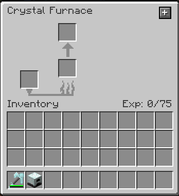
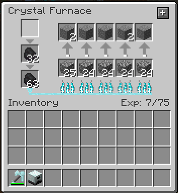

---
navigation:
  title: Crystal Furnace
  icon: crystal_furnace
  parent: index.md
item_ids:
  - crystal_tools:crystal_furnace
---
# Crystal Furnace
## Overview
<Row>
    <RecipeFor id="crystal_furnace" />
    <BlockImage id="crystal_furnace" scale="4" />
</Row>

The crystal furnace will smelt items like a vanilla furnace.

## Skills
The furnace has the following skills that you can level:
- Furnace Speed
  - Decreases the time to smelt items
- Fuel Efficiency
  - Increases the burn time of fuels
- Exp. Boost
  - Increases the amount of Minecraft experience that is generated
- Slot
  - Adds an extra input and output slot that work in parallel
- Fuel Slot
  - Adds an extra fuel slot
- Auto Split
  - Items in input slots are automatically split up evenly among the empty input slots
- Auto Output
  - Result items are automatically inserted into adjacent inventories
- Save Fuel
  - Will not burn fuel items when there are no items to smelt

Fully Upgraded Furnace:

