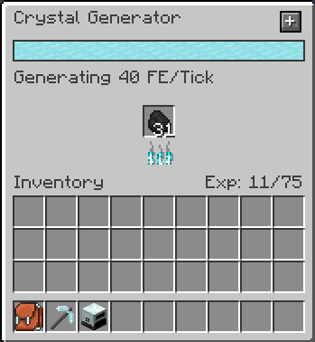
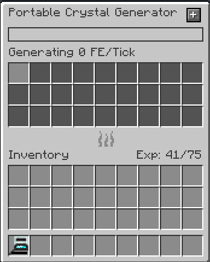

---
navigation:
  title: Crystal Generator
  icon: crystal_generator
  parent: index.md
item_ids:
  - crystal_tools:crystal_generator
  - crystal_tools:portable_crystal_generator
---
# Crystal Generator
## Overview
<Row>
    <RecipeFor id="crystal_generator" />
    <BlockImage id="crystal_generator" scale="4" />
</Row>

The crystal generator generates standard FE power using burnable resources.

You can also craft a portable version that can charge items in your inventory:

<Row>
    <RecipeFor id="portable_crystal_generator" />
</Row>

This portable version can be placed in the <ItemLink id="crystal_pedestal" /> to charge items of nearby players.

## Skills
- FE Generation
  - Increases the amount of FE generated per tick
- Fuel Efficiency
  - Increases the time that fuel will burn
- FE Capacity
  - Increases the amount of FE stored in the generator
- Redstone Control
  - Allows you to disable the generator with a redstone signal
- Metal Generator
  - Allows the generator to burn metals for power
- Food Generator
  - Allows the generator to burn food for power
- Gem Generator
  - Allows the generator to burn gems for power
- Save Fuel
  - The generator will not burn fuel when it cannot output power