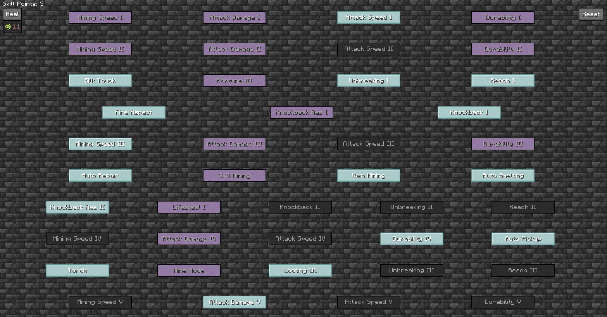
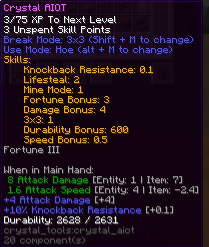

---
navigation:
  title: Crystal Tools
  icon: crystal
item_ids:
  - crystal_tools:crystal
  - crystal_tools:crystal_block
  - crystal_tools:netherite_stick
  - crystal_tools:crystal_ore
  - crystal_tools:crystal_deepslate_ore
---

# Crystal Tools
## Overview
Welcome to Crystal Tools!
This mod adds many tools and blocks that can be leveled up with usage to unlock new skills!

## Skills
To view the skill trees of items, hold them in your hand and press `k`. Here you can level new skills,
reset skills, heal your tool with skill points, or purchase skill points with experience:

You can view skill points and which skills you have by holding shift when hovering over the item:

## Getting Started
To get started, you will need to first find <ItemLink id="crystal" />s.
Crystal Ore spawns deep underground, from Y -64 to Y - 44 in small vein sizes.
<BlockImage id="crystal_deepslate_ore" scale="4" />

Then, you will need to get netherite to craft some <ItemLink id="netherite_stick" />s.
<RecipeFor id="netherite_stick" />

After that, you can craft some Crystal Tools, Crystal Armor, or Crystal Machines.

## Content
To view more information see the following pages:
<SubPages />