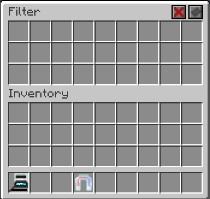

---
navigation:
  title: Crystal Magnet
  icon: crystal_magnet
  parent: index.md
item_ids:
  - crystal_tools:crystal_magnet
---

# Crystal Magnet
## Overview
<RecipeFor id="crystal_magnet" />

The crystal magnet can be used to pull in items near the player. It can also be worn in the Curios charm slot.
You can toggle the magnet on and off by pressing `N` by default.
The magnet gains experience by pulling in and picking up items.

With upgrades, you can also add a whitelist or blacklist filter to the magnet.

The magnet can be placed on the <ItemLink id="crystal_pedestal" /> to collect items in a range around it.

## Skills
Along with a lot of the common skills, the magnet has the following special skills:

- Item Speed
  - Increases the speed of items moving towards you
- Range
  - Increases the range of the magnet
- Filter Slots
  - Adds 9 filter slots to the magnet
- Attract EXP
  - Allows the magnet to attract experience orbs to you
- Attract Mobs
  - Allows the magnet to pull living entities towards you
  - Can be disabled with shift + `N`
- Instant Pickup
  - Items are no longer dragged towards you, they are instantly picked up when in range