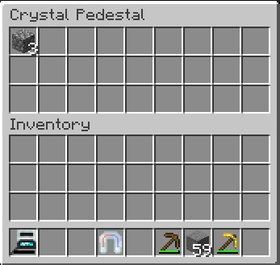
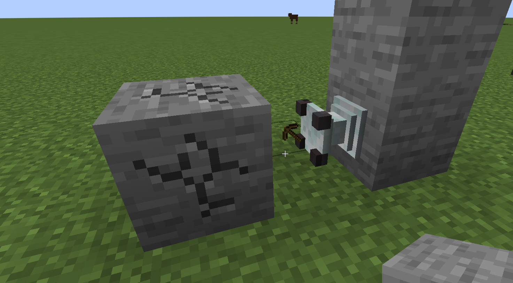

---
navigation:
  title: Crystal Pedestal
  icon: crystal_pedestal
  parent: index.md
item_ids:
  - crystal_tools:crystal_pedestal
---

# Crystal Pedestal
## Overview
<RecipeFor id="crystal_pedestal" />

The crystal pedestal is a block that has different effects depending on what item is placed on top of it.
You can check in JEI which items will do something when placed on a crystal pedestal.

Shift right-clicking the pedestal allows you to view its inventory:

## Actions
### BLOCK_BREAK
When any tool is placed on the crystal pedestal, it will break the block in front of it (if it is able).
This will still use the durability of the tool, and eventually break it.
Mining speed and drops are dependent on the tool (silk touch and forture will apply).

If the tool has entity interaction range on it, the pedestal can break blocks further away.

### MAGNET
When a <ItemLink id="crystal_magnet" /> is placed on the pedestal, nearby items will be attracted towards the
pedestal and collected in its inventory.
Any upgrades applied to the crystal magnet will apply to the pedestal as well (Range, Item Speed, Instant Pickup ...).

### CHARGING
When a <ItemLink id="portable_crystal_generator" /> is placed on the pedestal, it will charge nearby player's items.
It will burn any fuel items inside the pedestal's inventory.
The default range is 25 blocks.