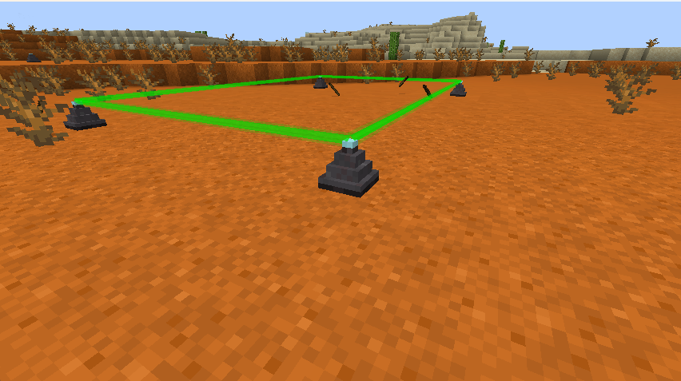
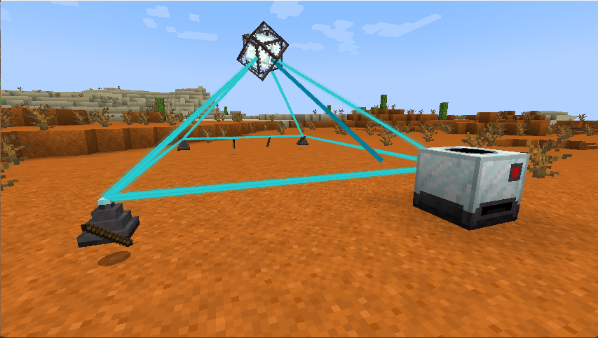
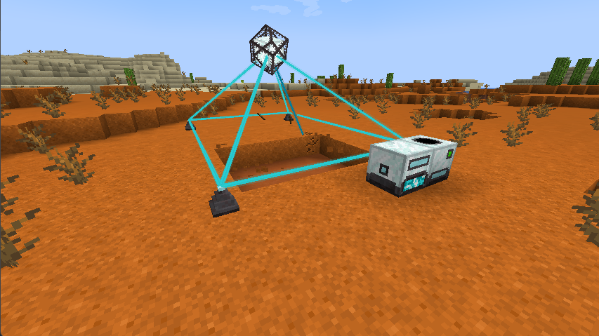
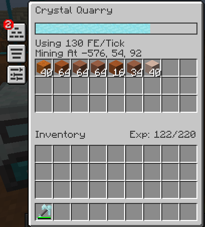
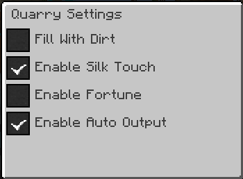
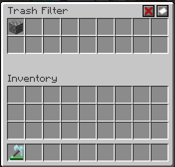

---
navigation:
  title: Crystal Quarry
  icon: crystal_quarry
  parent: index.md
item_ids:
  - crystal_tools:crystal_quarry
  - crystal_tools:quarry_stabilizer
---
# Crystal Quarry
## Overview
<Row>
    <RecipeFor id="crystal_quarry" />
    <RecipeFor id="quarry_stabilizer" />
    <BlockImage id="crystal_quarry" scale="4" />
</Row>

The crystal quarry will use power to mine out an area defined by 4 <ItemLink id="quarry_stabilizer" />s.

## Setup
First, place 4 <ItemLink id="quarry_stabilizer" />s in a square. You can right-click on one of them
to see if that are placed correctly.

Next, right-click one of the stabilizers with the quarry to link them. You can then place the quarry down
anywhere next to the square created by the stabilizers.

Finally, just provide the quarry with power and it should start mining.

## Skills
The quarry has the following skills that can be upgraded:
- Mining Speed
  - Increases the mining speed of the quarry
  - Will increase the power draw of the quarry by 10 FE/tick
- Redstone Control
  - Allows you to disable the quarry with a redstone signal
- Trash Filter
  - Allows you to specify certain items that should be automatically voided
- Auto Output
  - The quarry will automatically output items to adjacent inventories
- Silk Touch
  - The quarry will now mine all blocks with silk touch
  - Will increase the power draw of the quarry by 40 FE/tick
- Fortune
  - The quarry will now mine all blocks with fortune III
  - Will increase the power draw of the quarry by 40 FE/tick
- Chunkloading
  - The quarry will automatically load the chunk that it is in plus any chunks it is mining in
  - NOTE: The only loaded chunk that will be ticked will be the one that the quarry is placed in, so you should try to keep your energy generation in that chunk.

## GUI
When fully upgraded, the quarry has a few different screens that you can configure.

### Base Screen

This screen allows you to see / interact with the items that the quarry mines, as well as the energy usage,
energy stored, skill points, and skill experience.

### Settings Screen

This screen allows you to change the following settings about the quarry:
- Fill With Dirt
  - Unlocked by default
  - The quarry will fill in all blocks mined with dirt
- Enable Silk Touch
  - Unlocked by the Silk Touch Skill
  - Cannot be active at the same time as Fortune
- Enable Fortune
  - Unlocked by the Fortune Skill
  - Cannot be active at the same time as Silk Touch
- Enable Auto Output
  - Unlocked by the Auto Output Skill

### Trash Filter Screen

This screen allows you to configure certain items to be trashed.
When whitelist is active, the items in the filter will be trashed.
When blacklist is active, all items other than the ones in the filter will be trashed.